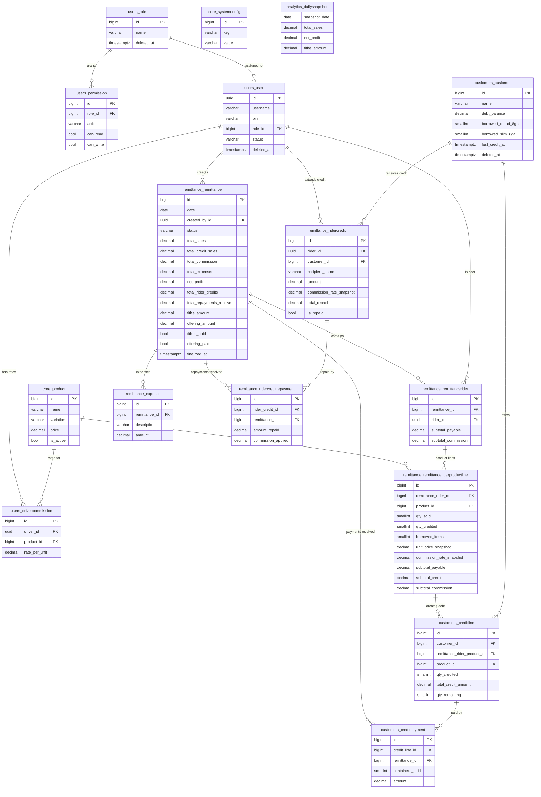

# Hydr8 — Domain-Driven Database Schema (v4 — Rider Credit & Repayment)
> Pivot from dispatch-centric to remittance-centric. Manual daily remittance entry. Rider-issued credits with repayment tracking. Gemma 2B edge AI. Light/Dark mode PWA.

---

## Architecture Overview

```
server/apps/
├── users/       ← Domain: Identity & Access (IAM + RBAC)
├── core/        ← Domain: Catalog & Configuration (shared kernel)
├── customers/   ← Domain: Customer Accounts (debts, borrowed items)
├── remittance/  ← Domain: Daily Remittance (primary operational domain)
└── analytics/   ← Domain: AI Insights & Reporting (read-only, Gemma 2B)
```

Unidirectional dependency flow (no circular imports):
```
users → core → customers → remittance → analytics
```

### Key Decision Record (v4 Clarifications)

| Decision | Rationale |
|---|---|
| No dispatch/session lifecycle | Replaced by daily manual remittance entry |
| One remittance per calendar day | Single `DATE` unique constraint on `remittance_remittance` |
| `qty_credited` creates customer debt record | Credited items tracked against `customers_customer.debt_balance` |
| Tithes computed on **Net Profit** | After commissions + expenses — not on gross sales |
| Commission is per-rider × per-product matrix | `users_drivercommission` retained unchanged |
| Offering is a manual entry per remittance | Entered at finalize time |
| Expenses are editable until finalized | Linked to the remittance, not a session |
| RBAC is admin-assignable | Not hardcoded — `users_permission` rows drive sidebar visibility |
| Gemma 2B downloads in background | System operates normally; settings page shows download status |
| AI chatbot is read-only | No write tools in this iteration |
| Light/Dark mode via CSS custom properties | Alpine.js toggles `data-theme` on `<html>`, persisted in `localStorage` |
| PIN stored on user model | Used for lockscreen timeout feature |
| Rider Credits are **session-independent** | Credits are standalone records; only linked to a session when repaid |
| Repayments **add to sales + commission** | Repaid amounts enter the remittance's financial totals; credits do not |
| Commission rate snapshotted on credit record | Consistent with existing `commission_rate_snapshot` pattern; avoids normalization breaking changes |

---

## Domain 1: Identity & Access (IAM)
**App:** `apps.users` | **DB prefix:** `users_`

### Table: `users_role`
| Column | Type | Constraints | Notes |
|---|---|---|---|
| `id` | `BIGINT` | PK, auto-increment | |
| `name` | `VARCHAR(100)` | UNIQUE, NOT NULL | `Admin`, `Staff`, `Driver` |
| `created_at` | `TIMESTAMPTZ` | NOT NULL, auto | |
| `updated_at` | `TIMESTAMPTZ` | NOT NULL, auto | |
| `deleted_at` | `TIMESTAMPTZ` | NULL | Soft delete |

**Seeded roles:** `Admin`, `Staff`, `Driver`

> [!NOTE]
> The old `Dispatcher` role is renamed `Staff`. Drivers still exist in the system for commission tracking but do not log in.

---

### Table: `users_permission`
| Column | Type | Constraints | Notes |
|---|---|---|---|
| `id` | `BIGINT` | PK, auto-increment | |
| `role_id` | `BIGINT` | FK → `users_role.id`, CASCADE | |
| `action` | `VARCHAR(100)` | NOT NULL | e.g. `dashboard`, `remittance`, `customers` |
| `can_read` | `BOOLEAN` | DEFAULT FALSE | |
| `can_write` | `BOOLEAN` | DEFAULT FALSE | |
| `can_update` | `BOOLEAN` | DEFAULT FALSE | |
| `can_delete` | `BOOLEAN` | DEFAULT FALSE | |
| `created_at` | `TIMESTAMPTZ` | NOT NULL, auto | |
| `updated_at` | `TIMESTAMPTZ` | NOT NULL, auto | |

**Unique constraint:** `(role_id, action)`

**Seeded permission matrix (default, Admin-adjustable):**

| Action | Admin | Staff | Driver |
|---|---|---|---|
| `dashboard` | R/W/U/D | R | — |
| `remittance` | R/W/U/D | R/W/U | — |
| `customers` | R/W/U/D | R/W/U | — |
| `products` | R/W/U/D | R | — |
| `employees` | R/W/U/D | — | — |
| `settings` | R/W/U/D | R | — |
| `analytics` | R | R | — |

> [!IMPORTANT]
> These defaults are seeded but **admin-adjustable** at runtime via the Employees & Users screen. The permission matrix drives sidebar visibility and view-level access checks via `PermissionRequiredMixin`.

---

### Table: `users_user` *(extends `AbstractUser`)*
| Column | Type | Constraints | Notes |
|---|---|---|---|
| `id` | `UUID` | PK, default `uuid4` | |
| `username` | `VARCHAR(150)` | UNIQUE, NOT NULL | |
| `email` | `VARCHAR(254)` | UNIQUE, NULL | Optional for staff/drivers |
| `first_name` | `VARCHAR(150)` | NOT NULL | |
| `last_name` | `VARCHAR(150)` | NOT NULL | |
| `password` | `VARCHAR(128)` | NOT NULL | Hashed (Django PBKDF2) |
| `pin` | `VARCHAR(128)` | NULL | Hashed PIN for lockscreen |
| `is_active` | `BOOLEAN` | DEFAULT TRUE | |
| `is_staff` | `BOOLEAN` | DEFAULT FALSE | |
| `is_superuser` | `BOOLEAN` | DEFAULT FALSE | |
| `role_id` | `BIGINT` | FK → `users_role.id`, RESTRICT, NULL | |
| `status` | `VARCHAR(20)` | CHOICES: `ACTIVE`, `DEACTIVATED` | |
| `created_at` | `TIMESTAMPTZ` | NOT NULL, auto | |
| `updated_at` | `TIMESTAMPTZ` | NOT NULL, auto | |
| `deleted_at` | `TIMESTAMPTZ` | NULL | Soft delete |
| `last_login` | `TIMESTAMPTZ` | NULL | Inherited |
| `date_joined` | `TIMESTAMPTZ` | NOT NULL | Inherited |

> [!IMPORTANT]
> `pin` is a new field in v3. It is hashed using Django's `make_password()` and checked with `check_password()`. It is **separate** from the login password and is used exclusively for the lockscreen timeout feature.

---

### Table: `users_drivercommission` *(commission rate matrix — unchanged from v2)*
| Column | Type | Constraints | Notes |
|---|---|---|---|
| `id` | `BIGINT` | PK, auto-increment | |
| `driver_id` | `UUID` | FK → `users_user.id`, CASCADE | Must be a user with `Driver` role |
| `product_id` | `BIGINT` | FK → `core_product.id`, CASCADE | |
| `rate_per_unit` | `DECIMAL(10,2)` | NOT NULL, DEFAULT 0.00 | ₱ per container delivered & sold (cash) |
| `created_at` | `TIMESTAMPTZ` | NOT NULL, auto | |
| `updated_at` | `TIMESTAMPTZ` | NOT NULL, auto | |

**Unique constraint:** `(driver_id, product_id)` — one rate per rider per product

> **"Set All" Bulk Rate:** The Products & Pricing screen has a "Set rate for all drivers" input per product. This triggers a bulk `UPDATE` via Django ORM — every driver row for that product is updated in one query. Each driver still has their own row; they're just batch-set.

**Indexes:**
- `(driver_id)` — Commission computation per rider
- `(product_id)` — Check if product has rates assigned

---

## Domain 2: Catalog & Configuration (Shared Kernel)
**App:** `apps.core` | **DB prefix:** `core_`

### Table: `core_product`
| Column | Type | Constraints | Notes |
|---|---|---|---|
| `id` | `BIGINT` | PK, auto-increment | |
| `name` | `VARCHAR(100)` | NOT NULL | e.g. `Purified`, `Alkaline` |
| `variation` | `VARCHAR(100)` | NOT NULL | e.g. `8-Gallon Round`, `8-Gallon Slim`, `500ml PET` |
| `price` | `DECIMAL(10,2)` | NOT NULL | Current retail price per unit |
| `is_active` | `BOOLEAN` | DEFAULT TRUE | Inactive = hidden from remittance dropdowns |
| `created_at` | `TIMESTAMPTZ` | NOT NULL, auto | |
| `updated_at` | `TIMESTAMPTZ` | NOT NULL, auto | |

**Unique constraint:** `(name, variation)`

> [!NOTE]
> Price changes only apply to **new** remittance lines. Existing `unit_price_snapshot` fields on saved remittance lines are immutable — they are copied at the time of entry, not read from this table at close time.

---

### Table: `core_systemconfig`
| Column | Type | Constraints | Notes |
|---|---|---|---|
| `id` | `BIGINT` | PK, auto-increment | |
| `key` | `VARCHAR(100)` | UNIQUE, NOT NULL | |
| `value` | `VARCHAR(255)` | NOT NULL | Cast by the application layer |
| `description` | `TEXT` | NULL | |
| `updated_at` | `TIMESTAMPTZ` | NOT NULL, auto | |
| `updated_by_id` | `UUID` | FK → `users_user.id`, SET NULL, NULL | |

**Seeded keys (v3):**

| `key` | Default `value` | Notes |
|---|---|---|
| `tithe_rate` | `0.10` | 10% of Net Profit per remittance |
| `lockscreen_timeout_minutes` | `5` | Minutes of idle before PIN prompt |
| `is_password_strict` | `false` | Enforce password complexity rules |
| `company_name` | `Hydr8 Water Station` | Shown in header + PDF receipts |
| `contact_number` | `` | Shown in settings company tab |
| `email_address` | `` | Shown in settings company tab |
| `session_close_pin` | `[hashed]` | PIN for finalizing remittance |
| `ai_model_id` | `gemma-2-2b-it-q4f16_1-MLC` | Currently loaded AI model identifier |
| `ai_model_version` | `2b-q4f16` | Display label for settings |
| `ai_download_status` | `not_started` | `not_started`, `downloading`, `ready` — updated by PWA |
| `ai_download_percent` | `0` | 0–100 integer, updated by PWA on progress |

> [!NOTE]
> `ai_download_status` and `ai_download_percent` are **client-driven** — the PWA writes to these via a dedicated authenticated PATCH endpoint when the Gemma download progresses. They allow the Settings page to show the AI status even across devices/sessions.

---

## Domain 3: Customer Accounts
**App:** `apps.customers` | **DB prefix:** `customers_`

> [!NOTE]
> This is the refactored form of `dispatch_customer` from v2, promoted to its own app to reflect the simplified architecture. The `dispatch_` prefix is dropped.

### Table: `customers_customer`
| Column | Type | Constraints | Notes |
|---|---|---|---|
| `id` | `BIGINT` | PK, auto-increment | |
| `name` | `VARCHAR(255)` | NOT NULL | |
| `address` | `TEXT` | NULL | Optional |
| `contact_number` | `VARCHAR(20)` | NULL | |
| `debt_balance` | `DECIMAL(10,2)` | DEFAULT 0.00, NOT NULL | Running ₱ debt total (denormalized) |
| `borrowed_round_8gal` | `SMALLINT` | DEFAULT 0, NOT NULL | Denormalized borrowed container count |
| `borrowed_slim_8gal` | `SMALLINT` | DEFAULT 0, NOT NULL | |
| `borrowed_other` | `SMALLINT` | DEFAULT 0, NOT NULL | |
| `last_credit_at` | `TIMESTAMPTZ` | NULL | Timestamp of most recent unpaid credit line |
| `notes` | `TEXT` | NULL | |
| `created_at` | `TIMESTAMPTZ` | NOT NULL, auto | |
| `updated_at` | `TIMESTAMPTZ` | NOT NULL, auto | |
| `deleted_at` | `TIMESTAMPTZ` | NULL | Soft delete |

> [!IMPORTANT]
> `debt_balance` and `borrowed_*` are **denormalized running totals** updated atomically with Django `F()` expressions. They are the source of truth for the dashboard card display. The `customers_creditline` table is the audit trail.
>
> `last_credit_at` enables the Customers screen to display "Days Since Last Unpaid Credit" without a subquery on every read.

**Indexes:**
- `(debt_balance)` — Filter customers with debt > 0
- `(last_credit_at)` — Sort by oldest unpaid credit

---

### Table: `customers_creditline` *(append-only ledger — one row per credited delivery line)*
| Column | Type | Constraints | Notes |
|---|---|---|---|
| `id` | `BIGINT` | PK, auto-increment | |
| `customer_id` | `BIGINT` | FK → `customers_customer.id`, PROTECT | |
| `remittance_rider_product_id` | `BIGINT` | FK → `remittance_remittanceriderproductline.id`, PROTECT | The remittance line that created this credit |
| `product_id` | `BIGINT` | FK → `core_product.id`, PROTECT | Denormalized for fast queries |
| `qty_credited` | `SMALLINT` | NOT NULL, MIN 1 | Containers taken on credit |
| `unit_price_snapshot` | `DECIMAL(10,2)` | NOT NULL | Price at time of remittance entry |
| `total_credit_amount` | `DECIMAL(12,2)` | NOT NULL | `qty_credited × unit_price_snapshot` |
| `qty_remaining` | `SMALLINT` | NOT NULL | Containers not yet paid (decremented on payment) |
| `created_at` | `TIMESTAMPTZ` | NOT NULL, auto | |

> [!NOTE]
> Credit lines are created automatically when a `remittance_remittanceriderproductline` with `qty_credited > 0` is saved. Each credit line is linked back to its remittance line for full audit traceability.

---

### Table: `customers_creditpayment` *(append-only — per-container payments)*
| Column | Type | Constraints | Notes |
|---|---|---|---|
| `id` | `BIGINT` | PK, auto-increment | |
| `credit_line_id` | `BIGINT` | FK → `customers_creditline.id`, PROTECT | |
| `remittance_id` | `BIGINT` | FK → `remittance_remittance.id`, PROTECT | Remittance session in which payment was received |
| `containers_paid` | `SMALLINT` | NOT NULL, MIN 1 | |
| `amount` | `DECIMAL(12,2)` | NOT NULL | `containers_paid × credit_line.unit_price_snapshot` |
| `recorded_by_id` | `UUID` | FK → `users_user.id`, SET NULL, NULL | |
| `created_at` | `TIMESTAMPTZ` | NOT NULL, auto | |

**Business rules on save:**
- `customers_customer.debt_balance -= amount` (atomic `F()` update)
- `customers_creditline.qty_remaining -= containers_paid` (atomic `F()` update)
- `containers_paid` must not exceed `credit_line.qty_remaining` (validated in service layer)
- `customers_customer.last_credit_at` is refreshed only if `qty_remaining` drops to 0 on all active credit lines — otherwise it remains unchanged

> [!IMPORTANT]
> **Partial payment is per-container, not per-peso.** You pay for 2 of 5 owed containers. You cannot pay ₱22.50 for half a container. The unit of debt is always 1 container.

**Indexes:**
- `(credit_line_id)` — Load all payments for one credit line
- `(remittance_id)` — Payments received within a given remittance

---

## Domain 4: Daily Remittance (Primary Operational Domain)
**App:** `apps.remittance` | **DB prefix:** `remittance_`

This is the **core domain** in v3. It replaces the entire `dispatch` + session lifecycle from v2.

### Table: `remittance_remittance` *(Top-level entity — one per calendar day)*
| Column | Type | Constraints | Notes |
|---|---|---|---|
| `id` | `BIGINT` | PK, auto-increment | |
| `date` | `DATE` | UNIQUE, NOT NULL | One remittance per calendar day enforced at DB level |
| `created_by_id` | `UUID` | FK → `users_user.id`, PROTECT | Admin/Staff who created this remittance |
| `finalized_by_id` | `UUID` | FK → `users_user.id`, SET NULL, NULL | Admin who finalized (NULL while DRAFT) |
| `status` | `VARCHAR(20)` | NOT NULL, DEFAULT `DRAFT` | `DRAFT` or `FINALIZED` |
| `total_sales` | `DECIMAL(12,2)` | DEFAULT 0.00 | Σ of all `qty_sold × unit_price_snapshot` + Σ of repayments received |
| `total_credit_sales` | `DECIMAL(12,2)` | DEFAULT 0.00 | Σ of all `qty_credited × unit_price_snapshot` |
| `total_commission` | `DECIMAL(12,2)` | DEFAULT 0.00 | Σ of all rider commissions + Σ of repayment commissions |
| `total_expenses` | `DECIMAL(12,2)` | DEFAULT 0.00 | Σ of all linked expenses |
| `total_borrowed_items` | `SMALLINT` | DEFAULT 0 | Σ of `borrowed_items` across all product lines |
| `net_profit` | `DECIMAL(12,2)` | DEFAULT 0.00 | `total_sales − total_commission − total_expenses` |
| `total_rider_credits` | `DECIMAL(12,2)` | DEFAULT 0.00 | Σ of all `remittance_ridercredit.amount` repaid in this session — **display only, excluded from net_profit** |
| `total_repayments_received` | `DECIMAL(12,2)` | DEFAULT 0.00 | Σ of `remittance_ridercreditrepayment.amount_repaid` — **included in total_sales** |
| `tithe_rate_snapshot` | `DECIMAL(5,4)` | NULL | Copied from `core_systemconfig['tithe_rate']` at finalize |
| `tithe_amount` | `DECIMAL(12,2)` | DEFAULT 0.00 | `net_profit × tithe_rate_snapshot` |
| `offering_amount` | `DECIMAL(12,2)` | DEFAULT 0.00 | Manually entered at finalize |
| `tithes_paid` | `BOOLEAN` | DEFAULT FALSE | Admin toggles after the fact |
| `offering_paid` | `BOOLEAN` | DEFAULT FALSE | Admin toggles after the fact |
| `notes` | `TEXT` | NULL | |
| `created_at` | `TIMESTAMPTZ` | NOT NULL, auto | |
| `updated_at` | `TIMESTAMPTZ` | NOT NULL, auto | |
| `finalized_at` | `TIMESTAMPTZ` | NULL | Set when status → FINALIZED |

**Business rules:**
- `UNIQUE(date)` enforced at DB level — only one remittance per calendar day.
- While `status = DRAFT`: all child rows are editable; totals are recalculated on each save.
- When `status → FINALIZED`: `tithe_rate_snapshot` is frozen from config; `finalized_at` is set; all child rows become immutable.
- `tithes_paid` and `offering_paid` remain toggleable even after finalization (these are updated after payment is made separately).

**Financial display model:**
```
─── Revenue ─────────────────────────────────────────────────────────
Total Sales          ₱[total_sales]     (cash sales + repayments received)
Credit Sales        +₱[total_credit_sales] (creates customer debt)

─── Deductions ──────────────────────────────────────────────────────
Total Commissions   -₱[total_commission]   (product lines + repayment commission)
Total Expenses      -₱[total_expenses]
                     ────────────
Net Profit           ₱[net_profit]    ← Bold, large, primary display

─── Credits Extended (rose/amber card — SEPARATE, NOT in net_profit) ─
Rider Credits This Session  ₱[total_rider_credits]
Repayments Received         ₱[total_repayments_received]
Note: Credits extended are NOT deducted from profit.
      They represent amounts owed back to the business.

─── Spiritual Obligations (amber card) ──────────────────────────────
Tithes Due (10% of Net)  ₱[tithe_amount]   ☐ Tithes Paid
Offering (manual)        ₱[offering_amount] ☐ Offering Paid
```

**Indexes:**
- `(date)` — Unique + primary lookup
- `(status)` — Dashboard: "is there a DRAFT remittance today?"
- `(tithes_paid, offering_paid)` — History: flag unpaid obligations

---

### Table: `remittance_remittancerider` *(one row per rider per remittance)*
| Column | Type | Constraints | Notes |
|---|---|---|---|
| `id` | `BIGINT` | PK, auto-increment | |
| `remittance_id` | `BIGINT` | FK → `remittance_remittance.id`, CASCADE | |
| `rider_id` | `UUID` | FK → `users_user.id`, PROTECT | Must have `Driver` role |
| `subtotal_payable` | `DECIMAL(12,2)` | DEFAULT 0.00 | Σ of product line `subtotal_payable` |
| `subtotal_commission` | `DECIMAL(12,2)` | DEFAULT 0.00 | Σ of product line `subtotal_commission` |
| `created_at` | `TIMESTAMPTZ` | NOT NULL, auto | |
| `updated_at` | `TIMESTAMPTZ` | NOT NULL, auto | |

**Unique constraint:** `(remittance_id, rider_id)` — one rider row per remittance

**Indexes:**
- `(remittance_id)` — Fetch all riders for a given remittance
- `(rider_id)` — Rider performance history

---

### Table: `remittance_remittanceriderproductline` *(manual entry rows — one per product per rider)*
| Column | Type | Constraints | Notes |
|---|---|---|---|
| `id` | `BIGINT` | PK, auto-increment | |
| `remittance_rider_id` | `BIGINT` | FK → `remittance_remittancerider.id`, CASCADE | |
| `product_id` | `BIGINT` | FK → `core_product.id`, PROTECT | |
| `qty_sold` | `SMALLINT` | NOT NULL, MIN 0 | Containers sold for cash |
| `qty_credited` | `SMALLINT` | DEFAULT 0 | Containers taken on credit (creates `customers_creditline`) |
| `borrowed_items` | `SMALLINT` | DEFAULT 0 | Containers borrowed (empty containers left with customer) |
| `unit_price_snapshot` | `DECIMAL(10,2)` | NOT NULL | Copied from `core_product.price` at entry time — immutable |
| `commission_rate_snapshot` | `DECIMAL(10,2)` | NOT NULL, DEFAULT 0.00 | Copied from `users_drivercommission` at entry time — immutable |
| `subtotal_payable` | `DECIMAL(12,2)` | NOT NULL | `qty_sold × unit_price_snapshot` |
| `subtotal_credit` | `DECIMAL(12,2)` | NOT NULL | `qty_credited × unit_price_snapshot` |
| `subtotal_commission` | `DECIMAL(12,2)` | NOT NULL | `qty_sold × commission_rate_snapshot` |
| `created_at` | `TIMESTAMPTZ` | NOT NULL, auto | |
| `updated_at` | `TIMESTAMPTZ` | NOT NULL, auto | |

**Unique constraint:** `(remittance_rider_id, product_id)` — one product per rider per remittance

> [!IMPORTANT]
> **Snapshot pattern is mandatory.** `unit_price_snapshot` and `commission_rate_snapshot` are copied at the moment the row is created/updated. Future price or commission rate changes do NOT affect finalized or even saved-draft lines. This preserves the financial audit integrity.

**Business rules on save:**
- Recalculate `subtotal_payable`, `subtotal_credit`, `subtotal_commission` from quantities × snapshots.
- Propagate updated subtotals up to `remittance_remittancerider` (atomic `F()` or service-layer update).
- Propagate to `remittance_remittance` totals.
- If `qty_credited > 0` and remittance is being finalized: create/update `customers_creditline` records.

**Indexes:**
- `(remittance_rider_id)` — Fetch all product lines for one rider
- `(product_id)` — Analytics: product performance across remittances

---

### Table: `remittance_expense` *(operational costs per remittance)*
| Column | Type | Constraints | Notes |
|---|---|---|---|
| `id` | `BIGINT` | PK, auto-increment | |
| `remittance_id` | `BIGINT` | FK → `remittance_remittance.id`, CASCADE | |
| `description` | `VARCHAR(255)` | NOT NULL | e.g. "Fuel — Rider A motorcycle" |
| `amount` | `DECIMAL(10,2)` | NOT NULL | |
| `recorded_by_id` | `UUID` | FK → `users_user.id`, SET NULL, NULL | |
| `created_at` | `TIMESTAMPTZ` | NOT NULL, auto | |

> Editable until the remittance is `FINALIZED`. Adding or editing an expense triggers a recalculation of `remittance_remittance.total_expenses` and `net_profit`.

**Index:** `(remittance_id)`

---

### Table: `remittance_ridercredit` *(standalone — rider-issued credit, session-independent at creation)*
| Column | Type | Constraints | Notes |
|---|---|---|---|
| `id` | `BIGINT` | PK, auto-increment | |
| `rider_id` | `UUID` | FK → `users_user.id`, PROTECT | The rider who extended the credit (must have `Driver` role) |
| `recipient_name` | `VARCHAR(255)` | NOT NULL | Free-text name of the credit recipient (backed by customer combobox for autocomplete) |
| `customer_id` | `BIGINT` | FK → `customers_customer.id`, SET NULL, NULL | Optional link to a formal customer record for audit purposes |
| `amount` | `DECIMAL(12,2)` | NOT NULL, MIN 0.01 | ₱ amount of credit extended |
| `commission_rate_snapshot` | `DECIMAL(10,2)` | NOT NULL, DEFAULT 0.00 | Rider's active commission rate at time of credit entry — used for repayment commission calc |
| `total_repaid` | `DECIMAL(12,2)` | DEFAULT 0.00 | Running total of all repayments made against this credit — for quick summary display |
| `is_repaid` | `BOOLEAN` | DEFAULT FALSE | Set to TRUE when `total_repaid >= amount` |
| `notes` | `TEXT` | NULL | Optional context (e.g. "5 purified gallons") |
| `recorded_by_id` | `UUID` | FK → `users_user.id`, SET NULL, NULL | Staff who entered the credit |
| `created_at` | `TIMESTAMPTZ` | NOT NULL, auto | |
| `updated_at` | `TIMESTAMPTZ` | NOT NULL, auto | |

> [!IMPORTANT]
> **Credits are session-independent at creation.** There is NO `remittance_id` FK on this table. A credit is an independent business obligation. It is only linked to a remittance session when a **repayment** is received in that session (via `remittance_ridercreditrepayment`). This keeps the credit ledger clean and queryable across any time window.
>
> **Credits are NOT counted in any remittance's financial totals.** They do not affect `total_sales`, `total_commission`, `net_profit`, or `tithes`. They are a **separate display section** in the remittance UI.

**Business rules on save:**
- `commission_rate_snapshot` is copied from `users_drivercommission` for the given rider at entry time. If no commission row exists, defaults to `0.00`.
- `total_repaid` and `is_repaid` are updated atomically via `F()` expressions whenever a linked `remittance_ridercreditrepayment` is saved.

**Indexes:**
- `(rider_id)` — Filter credits by rider
- `(is_repaid)` — Quickly find open credits for the repayment dropdown
- `(created_at)` — Chronological credit history per customer lookup

---

### Table: `remittance_ridercreditrepayment` *(one row per repayment event — links credit to a session)*
| Column | Type | Constraints | Notes |
|---|---|---|---|
| `id` | `BIGINT` | PK, auto-increment | |
| `rider_credit_id` | `BIGINT` | FK → `remittance_ridercredit.id`, PROTECT | The original credit being repaid |
| `remittance_id` | `BIGINT` | FK → `remittance_remittance.id`, CASCADE | The session in which repayment was collected |
| `amount_repaid` | `DECIMAL(12,2)` | NOT NULL, MIN 0.01 | ₱ repaid in this event |
| `commission_applied` | `DECIMAL(12,2)` | NOT NULL | `amount_repaid × rider_credit.commission_rate_snapshot` — computed on save |
| `recorded_by_id` | `UUID` | FK → `users_user.id`, SET NULL, NULL | |
| `created_at` | `TIMESTAMPTZ` | NOT NULL, auto | |

**Business rules on save:**
- `commission_applied` = `amount_repaid × rider_credit.commission_rate_snapshot` (read from parent credit, not from current commission matrix).
- Atomic updates to the parent remittance:
  - `remittance_remittance.total_sales += amount_repaid` (via `F()` expression)
  - `remittance_remittance.total_commission += commission_applied` (via `F()` expression)
  - `remittance_remittance.total_repayments_received += amount_repaid` (via `F()` expression)
  - `net_profit` recalculated: `total_sales − total_commission − total_expenses`
- Atomic updates to parent credit:
  - `remittance_ridercredit.total_repaid += amount_repaid` (via `F()` expression)
  - `remittance_ridercredit.is_repaid = True` if `total_repaid >= amount`
- Validation: `amount_repaid` must not cause `total_repaid` to exceed `rider_credit.amount`.

> [!IMPORTANT]
> The `remittance_id` on this table is what **links a credit to a session** — but only at repayment time. The credit itself has no session FK. This is the correct model: the credit is a free-floating obligation, and the session is the event that resolves it (partially or fully).

**Indexes:**
- `(rider_credit_id)` — Load all repayments for one credit
- `(remittance_id)` — Repayments received within a given session

---

## Domain 5: Analytics & AI Insights (Read-Only)
**App:** `apps.analytics` | **DB prefix:** `analytics_`

> [!NOTE]
> This domain provides lightweight Django REST API endpoints consumed by the PWA's Gemma 2B edge model via tool-calling (JSON Mode). No GPU inference runs server-side. The server only returns structured data; Gemma synthesizes the natural-language response on the client device.

### API Endpoints (Django REST Framework, read-only)

| Tool Name | Endpoint | Returns |
|---|---|---|
| `fetch_remittance_summary` | `GET /api/analytics/remittance-summary/?start=&end=` | Aggregated totals per day range |
| `fetch_rider_performance` | `GET /api/analytics/rider-performance/?rider_id=&start=&end=` | Per-rider sales, commission, product breakdown |
| `fetch_customer_debts` | `GET /api/analytics/customer-debts/?filter=` | Customer list with `debt_balance`, `days_overdue` |
| `fetch_tithe_status` | `GET /api/analytics/tithe-status/` | List of remittances with unpaid tithes/offerings |
| `fetch_ai_model_status` | `GET /api/analytics/ai-status/` | Returns `ai_download_status`, `ai_download_percent` from config |
| `PATCH /api/analytics/ai-status/` | Updates `ai_download_status` and `ai_download_percent` | PWA progress callback writes here |

All endpoints require `IsAuthenticated`. All responses use minimal field selection (no `SELECT *`).

### Table: `analytics_dailysnapshot` *(pg_cron — write once, read many)*
| Column | Type | Notes |
|---|---|---|
| `snapshot_date` | `DATE` UNIQUE | The day aggregated |
| `total_sales` | `DECIMAL(12,2)` | |
| `total_credit_sales` | `DECIMAL(12,2)` | |
| `total_commission` | `DECIMAL(12,2)` | |
| `total_expenses` | `DECIMAL(12,2)` | |
| `net_profit` | `DECIMAL(12,2)` | |
| `tithe_amount` | `DECIMAL(12,2)` | |
| `total_borrowed_items` | `SMALLINT` | |
| `created_at` | `TIMESTAMPTZ` | When pg_cron job ran |

> pg_cron job runs nightly at 23:55 to snapshot the finalized remittance for that day into this table for fast analytics queries.

---

## Entity-Relationship Diagram



---

## Cross-Domain Dependency Map

```
users_role ←── users_user ──→ users_drivercommission ←── core_product
                  │                                             │
                  │◄────────────────────────────────────────────┘
                  ▼
           remittance_remittance ←──────────────────────────────────────────┐
          /        |         \                                               │
         ▼         ▼          ▼                                              │
remittance_    remittance_  remittance_       remittance_ridercredit         │
remittancerider  expense   (totals rollup)    (standalone — no session FK)  │
      │                                              │                       │
      ▼                                              ▼                       │
remittance_remittanceriderproductline    remittance_ridercreditrepayment ───►┘
      │                                    (links credit → session on repay)
      ▼
customers_creditline ──→ customers_creditpayment
      │
      ▼
customers_customer (debt_balance, borrowed_* denorm)

users_user ──→ remittance_ridercredit ←── customers_customer
                  (rider extends)           (recipient optional link)
```

---

## Key ORM Patterns (Anti-N+1 Reference)

### Dashboard: Today's Remittance Summary
```python
# apps/remittance/selectors.py
from django.utils import timezone

def get_todays_remittance():
    today = timezone.localdate()
    return (
        Remittance.objects
        .prefetch_related(
            Prefetch(
                'riders',
                queryset=RemittanceRider.objects
                    .select_related('rider')
                    .prefetch_related('product_lines__product'),
                to_attr='rider_rows'
            ),
            'expenses',
        )
        .filter(date=today)
        .first()  # Returns None if no remittance created yet today
    )
```

### Remittance Form: Add Product Line & Propagate Totals
```python
# apps/remittance/services.py
from django.db.models import F, Sum

def save_product_line(remittance_rider, product, qty_sold, qty_credited, borrowed_items):
    """
    Creates or updates a product line and propagates totals upward atomically.
    Called on every HTMX form save (partial submit, not just on finalize).
    """
    product_obj = Product.objects.get(pk=product.id)
    try:
        commission_rate = DriverCommission.objects.get(
            driver=remittance_rider.rider,
            product=product_obj
        ).rate_per_unit
    except DriverCommission.DoesNotExist:
        commission_rate = Decimal('0.00')

    subtotal_payable = qty_sold * product_obj.price
    subtotal_credit = qty_credited * product_obj.price
    subtotal_commission = qty_sold * commission_rate

    line, created = RemittanceRiderProductLine.objects.update_or_create(
        remittance_rider=remittance_rider,
        product=product_obj,
        defaults={
            'qty_sold': qty_sold,
            'qty_credited': qty_credited,
            'borrowed_items': borrowed_items,
            'unit_price_snapshot': product_obj.price,
            'commission_rate_snapshot': commission_rate,
            'subtotal_payable': subtotal_payable,
            'subtotal_credit': subtotal_credit,
            'subtotal_commission': subtotal_commission,
        }
    )

    # Recalculate rider row totals from all its product lines
    rider_agg = RemittanceRiderProductLine.objects.filter(
        remittance_rider=remittance_rider
    ).aggregate(
        payable=Sum('subtotal_payable'),
        commission=Sum('subtotal_commission'),
    )
    RemittanceRider.objects.filter(pk=remittance_rider.pk).update(
        subtotal_payable=rider_agg['payable'] or 0,
        subtotal_commission=rider_agg['commission'] or 0,
    )

    # Recalculate remittance-level totals from all its riders
    _recalculate_remittance_totals(remittance_rider.remittance)
    return line


def _recalculate_remittance_totals(remittance):
    """
    Single source of truth for totals rollup. Call after any mutation.

    IMPORTANT: Rider credits (remittance_ridercredit) are NOT included in
    sales, commission, or net_profit. They are tracked separately via
    total_rider_credits for display purposes only.

    Repayments (remittance_ridercreditrepayment) ARE included — they add
    to total_sales and total_commission, which flows into net_profit.
    """
    # Product line aggregates (cash sales + credits + borrowed)
    line_agg = RemittanceRiderProductLine.objects.filter(
        remittance_rider__remittance=remittance
    ).aggregate(
        sales=Sum('subtotal_payable'),
        credit=Sum('subtotal_credit'),
        commission=Sum('subtotal_commission'),
        borrowed=Sum('borrowed_items'),
    )

    # Repayment aggregates — these ARE financial (add to sales + commission)
    repayment_agg = RiderCreditRepayment.objects.filter(
        remittance=remittance
    ).aggregate(
        repaid=Sum('amount_repaid'),
        repayment_commission=Sum('commission_applied'),
    )

    expense_total = Expense.objects.filter(
        remittance=remittance
    ).aggregate(total=Sum('amount'))['total'] or 0

    product_sales = line_agg['sales'] or 0
    repayments = repayment_agg['repaid'] or 0
    product_commission = line_agg['commission'] or 0
    repayment_commission = repayment_agg['repayment_commission'] or 0

    total_sales = product_sales + repayments
    total_commission = product_commission + repayment_commission
    net_profit = total_sales - total_commission - expense_total

    Remittance.objects.filter(pk=remittance.pk).update(
        total_sales=total_sales,
        total_credit_sales=line_agg['credit'] or 0,
        total_commission=total_commission,
        total_expenses=expense_total,
        total_borrowed_items=line_agg['borrowed'] or 0,
        total_repayments_received=repayments,
        net_profit=net_profit,
        # total_rider_credits is updated separately by add_rider_credit() service
    )
```

### Finalize Remittance: Snapshot + Create Credit Lines
```python
# apps/remittance/services.py
from django.db import transaction
from django.utils import timezone
from decimal import Decimal

@transaction.atomic
def finalize_remittance(remittance, offering_amount, finalized_by):
    """
    PIN-verified. Freezes the remittance.
    1. Snapshots tithe rate.
    2. Computes final tithes on net_profit (not gross).
    3. Creates customers_creditline for all qty_credited > 0 lines.
    4. Updates customers_customer.last_credit_at where applicable.
    5. Sets status → FINALIZED.
    """
    if remittance.status == 'FINALIZED':
        raise ValueError("Remittance is already finalized.")

    tithe_rate = Decimal(SystemConfig.objects.get_value('tithe_rate', '0.10'))
    _recalculate_remittance_totals(remittance)
    remittance.refresh_from_db()

    tithe_amount = remittance.net_profit * tithe_rate

    # Create credit lines for all credited product lines
    for rider_row in remittance.riders.prefetch_related('product_lines__product').all():
        for line in rider_row.product_lines.all():
            if line.qty_credited > 0:
                # Credit lines link back to the remittance line for traceability
                CreditLine.objects.create(
                    customer=None,  # NOTE: customer assignment handled via UI before finalize
                    remittance_rider_product=line,
                    product=line.product,
                    qty_credited=line.qty_credited,
                    unit_price_snapshot=line.unit_price_snapshot,
                    total_credit_amount=line.subtotal_credit,
                    qty_remaining=line.qty_credited,
                )

    Remittance.objects.filter(pk=remittance.pk).update(
        status='FINALIZED',
        tithe_rate_snapshot=tithe_rate,
        tithe_amount=tithe_amount,
        offering_amount=offering_amount,
        finalized_by=finalized_by,
        finalized_at=timezone.now(),
    )
```

### Rider Credit: Add Credit & Record Repayment
```python
# apps/remittance/services.py
from decimal import Decimal
from django.db import transaction
from django.db.models import F, Sum

def add_rider_credit(rider, recipient_name, amount, recorded_by, customer=None):
    """
    Creates a standalone rider credit record. This is session-independent —
    no remittance FK is set here. The credit will be linked to a session
    only when a repayment is recorded against it.

    The commission_rate_snapshot is copied from the rider's active
    commission rate at time of entry (averaged across products if multi-product,
    or the default rate if none set). This snapshot is immutable for repayment calc.

    FINANCIAL EFFECT: None. This does NOT touch any remittance totals.
    """
    from apps.users.models import DriverCommission

    # Snapshot the rider's commission rate (use the highest rate or a default)
    # Adjust this logic per business rules if a specific product is associated.
    rate_qs = DriverCommission.objects.filter(driver=rider)
    commission_rate = rate_qs.order_by('-rate_per_unit').values_list(
        'rate_per_unit', flat=True
    ).first() or Decimal('0.00')

    credit = RiderCredit.objects.create(
        rider=rider,
        recipient_name=recipient_name,
        customer=customer,
        amount=amount,
        commission_rate_snapshot=commission_rate,
        recorded_by=recorded_by,
    )
    return credit


@transaction.atomic
def record_repayment(rider_credit, remittance, amount_repaid, recorded_by):
    """
    Records a repayment event for a prior rider credit.
    This is the moment the credit is linked to a session.

    FINANCIAL EFFECT:
    - total_sales += amount_repaid
    - total_commission += commission_applied
    - total_repayments_received += amount_repaid
    - net_profit recalculated
    - rider_credit.total_repaid += amount_repaid
    - rider_credit.is_repaid = True if fully paid
    """
    remaining = rider_credit.amount - rider_credit.total_repaid
    if amount_repaid > remaining:
        raise ValueError(
            f"Repayment of ₱{amount_repaid} exceeds outstanding balance "
            f"of ₱{remaining} for this credit."
        )

    commission_applied = amount_repaid * rider_credit.commission_rate_snapshot

    repayment = RiderCreditRepayment.objects.create(
        rider_credit=rider_credit,
        remittance=remittance,
        amount_repaid=amount_repaid,
        commission_applied=commission_applied,
        recorded_by=recorded_by,
    )

    # Atomically update the parent credit's running total
    new_total_repaid = rider_credit.total_repaid + amount_repaid
    RiderCredit.objects.filter(pk=rider_credit.pk).update(
        total_repaid=F('total_repaid') + amount_repaid,
        is_repaid=(new_total_repaid >= rider_credit.amount),
    )

    # Propagate to remittance financials — repayments ARE in the P&L
    Remittance.objects.filter(pk=remittance.pk).update(
        total_sales=F('total_sales') + amount_repaid,
        total_commission=F('total_commission') + commission_applied,
        total_repayments_received=F('total_repayments_received') + amount_repaid,
    )
    # Recalculate net_profit after the F() updates flush
    _recalculate_remittance_totals(remittance)

    return repayment


def update_remittance_rider_credits_display(remittance):
    """
    Updates the total_rider_credits display aggregate on the remittance.
    Called when a credit is added or removed (editable only while DRAFT).
    NOTE: This value is display-only and does NOT affect net_profit.
    """
    # Credits linked to this session via their repayments
    total = RiderCreditRepayment.objects.filter(
        remittance=remittance
    ).aggregate(total=Sum('amount_repaid'))['total'] or Decimal('0.00')

    Remittance.objects.filter(pk=remittance.pk).update(
        total_rider_credits=total,
    )
```

### Customers: Days Since Last Unpaid Credit
```python
# apps/customers/selectors.py
from django.utils import timezone

def get_customers_with_debt():
    """
    Returns customers who have outstanding debt or borrowed items.
    Includes computed 'days_overdue' for display without a subquery per row.
    """
    today = timezone.now()
    customers = (
        Customer.objects
        .filter(deleted_at__isnull=True)
        .filter(models.Q(debt_balance__gt=0) | models.Q(borrowed_round_8gal__gt=0) | models.Q(borrowed_slim_8gal__gt=0))
        .order_by('-debt_balance')
    )
    # Annotate days_overdue using the denormalized last_credit_at
    for customer in customers:
        if customer.last_credit_at:
            delta = today - customer.last_credit_at
            customer.days_overdue = delta.days
        else:
            customer.days_overdue = None
    return customers
```

---

## Migration Sequence (v3 — Fresh Dev, No Data Migration)

```bash
# 1. IAM domain (no external deps)
python manage.py makemigrations users

# 2. Shared kernel
python manage.py makemigrations core

# 3. Customer accounts (refs users + core)
python manage.py makemigrations customers

# 4. Remittance domain (refs users + core + customers)
python manage.py makemigrations remittance

# 5. Analytics (refs remittance — can stay empty for now)
python manage.py makemigrations analytics

# 6. Apply all migrations
python manage.py migrate

# 7. Seed required data
python manage.py loaddata roles permissions system_config
```

> [!NOTE]
> The `dispatch` app from v2 is **deprecated**. Remove it from `INSTALLED_APPS` and delete its migrations. No data migration is needed (fresh dev environment).
