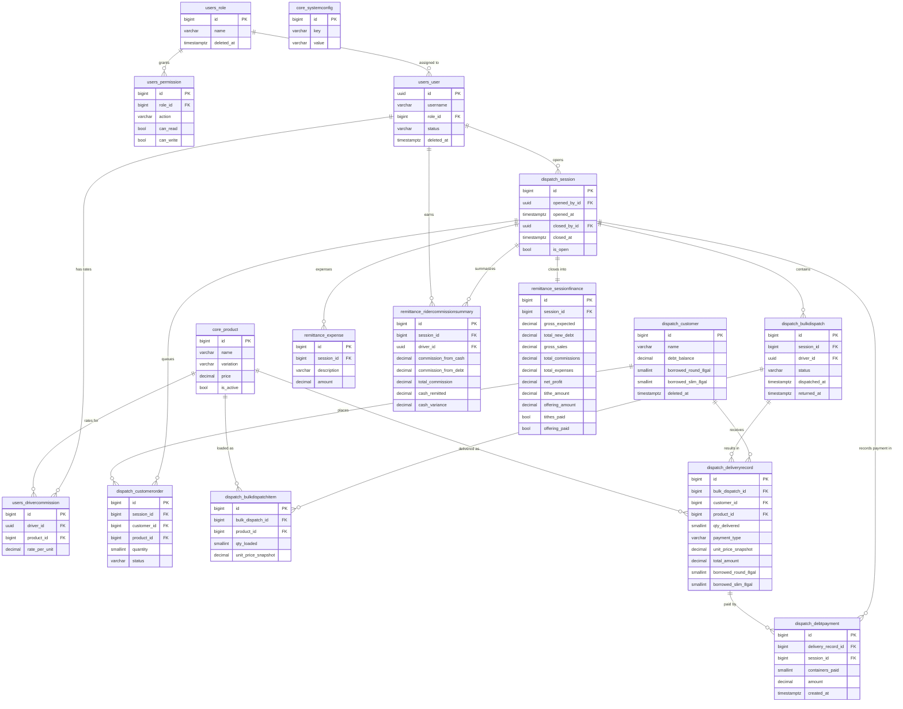

# Hydr8 — Domain-Driven Database Schema (v2 — Final)
> Incorporates all user clarifications. Maps 1-to-1 with Django apps in `server/apps/`.

---

## Architecture Overview

```
server/apps/
├── users/        ← Domain: Identity & Access (IAM)
├── core/         ← Domain: Catalog & Configuration (shared kernel)
├── dispatch/     ← Domain: Operations (Sessions, Dispatches, Deliveries, Customers)
├── remittance/   ← Domain: Finance (Session Finance, Expenses, Tithes)
└── analytics/    ← Domain: Reporting (read-only aggregates — Week 2)
```

Unidirectional dependency flow (no circular imports):
```
users → core → dispatch → remittance → analytics
```

### Key Decision Record (from user clarifications)

| Decision | Rationale |
|---|---|
| Session is time-bounded, not date-bounded | Opened/closed manually by admin; PIN-protected close |
| Dispatch is bulk (per rider), not per-customer | Customer assignment happens on return |
| Commission is a rider × product rate matrix | Removed `commission_rate` from `users_user` |
| Debt payment is per-container (no fractional amounts) | Keeps commission tracking clean |
| Retroactive commission on debt repayment | When debt paid, original rider earns commission |
| Tithes/Offerings do NOT reduce Net Profit | Shown as separate spiritual obligations |
| Gross Expected = all deliveries + debt paid in; Gross Sales = Gross Expected - new debt | Three-line financial display |
| Order Queue (Kanban) is independent of bulk dispatch | Separate `dispatch_customerorder` table |
| Dispatch status defaults to DISPATCHED (no PENDING) | Simplified state machine |

---

## Domain 1: Identity & Access (IAM)
**App:** `apps.users` | **DB prefix:** `users_`

### Table: `users_role`
| Column | Type | Constraints | Notes |
|---|---|---|---|
| `id` | `BIGINT` | PK, auto-increment | |
| `name` | `VARCHAR(100)` | UNIQUE, NOT NULL | `Admin`, `Dispatcher`, `Driver` |
| `created_at` | `TIMESTAMPTZ` | NOT NULL, auto | |
| `updated_at` | `TIMESTAMPTZ` | NOT NULL, auto | |
| `deleted_at` | `TIMESTAMPTZ` | NULL | Soft delete |

### Table: `users_permission`
| Column | Type | Constraints | Notes |
|---|---|---|---|
| `id` | `BIGINT` | PK, auto-increment | |
| `role_id` | `BIGINT` | FK → `users_role.id`, CASCADE | |
| `action` | `VARCHAR(100)` | NOT NULL | e.g. `dashboard`, `session`, `settings` |
| `can_read` | `BOOLEAN` | DEFAULT FALSE | |
| `can_write` | `BOOLEAN` | DEFAULT FALSE | |
| `can_update` | `BOOLEAN` | DEFAULT FALSE | |
| `can_delete` | `BOOLEAN` | DEFAULT FALSE | |
| `created_at` | `TIMESTAMPTZ` | NOT NULL, auto | |
| `updated_at` | `TIMESTAMPTZ` | NOT NULL, auto | |

**Unique constraint:** `(role_id, action)`

**Seeded permission matrix:**

| Action | Admin | Dispatcher | Driver |
|---|---|---|---|
| `dashboard` | R/W/U/D | R | — |
| `dispatch` | R/W/U/D | R/W/U | — |
| `order_queue` | R/W/U/D | R/W/U | — |
| `session` | R/W/U/D | — | — |
| `customers` | R/W/U/D | R/W/U | — |
| `settings` | R/W/U/D | — | — |
| `analytics` | R | — | — |

### Table: `users_user` *(extends `AbstractUser`)*
| Column | Type | Constraints | Notes |
|---|---|---|---|
| `id` | `UUID` | PK, default `uuid4` | |
| `username` | `VARCHAR(150)` | UNIQUE, NOT NULL | |
| `email` | `VARCHAR(254)` | UNIQUE, NOT NULL | |
| `first_name` | `VARCHAR(150)` | NOT NULL | |
| `last_name` | `VARCHAR(150)` | NOT NULL | |
| `password` | `VARCHAR(128)` | NOT NULL | Hashed |
| `is_active` | `BOOLEAN` | DEFAULT TRUE | |
| `is_staff` | `BOOLEAN` | DEFAULT FALSE | |
| `is_superuser` | `BOOLEAN` | DEFAULT FALSE | |
| `role_id` | `BIGINT` | FK → `users_role.id`, RESTRICT, NULL | |
| `status` | `VARCHAR(20)` | CHOICES: `ACTIVE`, `DEACTIVATED` | |
| `created_at` | `TIMESTAMPTZ` | NOT NULL, auto | |
| `updated_at` | `TIMESTAMPTZ` | NOT NULL, auto | |
| `deleted_at` | `TIMESTAMPTZ` | NULL | Soft delete |
| `last_login` | `TIMESTAMPTZ` | NULL | Inherited |
| `date_joined` | `TIMESTAMPTZ` | NOT NULL | Inherited |

> [!IMPORTANT]
> `commission_rate` field **removed** from this model compared to v1. Commission is now a per-rider × per-product matrix stored in `users_drivercommission`.

### Table: `users_drivercommission` *(NEW — commission rate matrix)*
| Column | Type | Constraints | Notes |
|---|---|---|---|
| `id` | `BIGINT` | PK, auto-increment | |
| `driver_id` | `UUID` | FK → `users_user.id`, CASCADE | |
| `product_id` | `BIGINT` | FK → `core_product.id`, CASCADE | |
| `rate_per_unit` | `DECIMAL(10,2)` | NOT NULL, DEFAULT 0.00 | ₱ per container, fixed amount |
| `created_at` | `TIMESTAMPTZ` | NOT NULL, auto | |
| `updated_at` | `TIMESTAMPTZ` | NOT NULL, auto | |

**Unique constraint:** `(driver_id, product_id)` — one rate per rider per product

> **"Set All" Global Rate:** The Settings UI will have a "Set rate for all drivers" input per product. This triggers a bulk `UPDATE` via Django ORM on this table — it does NOT bypass the 1:1 model. Every driver still gets their own row; they're just all updated to the same value in one action.

**Indexes:**
- `(driver_id)` — Pulled when computing commission at session close
- `(product_id)` — Pulled when checking if a product has rates assigned

---

## Domain 2: Catalog & Configuration (Shared Kernel)
**App:** `apps.core` | **DB prefix:** `core_`

### Table: `core_product`
| Column | Type | Constraints | Notes |
|---|---|---|---|
| `id` | `BIGINT` | PK, auto-increment | |
| `name` | `VARCHAR(100)` | NOT NULL | e.g. `Purified`, `Alkaline` |
| `variation` | `VARCHAR(100)` | NOT NULL | e.g. `8-Gallon Round`, `8-Gallon Slim`, `500ml PET` |
| `price` | `DECIMAL(10,2)` | NOT NULL | Current retail price per unit |
| `is_active` | `BOOLEAN` | DEFAULT TRUE | |
| `created_at` | `TIMESTAMPTZ` | NOT NULL, auto | |
| `updated_at` | `TIMESTAMPTZ` | NOT NULL, auto | |

**Unique constraint:** `(name, variation)`

### Table: `core_systemconfig`
| Column | Type | Constraints | Notes |
|---|---|---|---|
| `id` | `BIGINT` | PK, auto-increment | |
| `key` | `VARCHAR(100)` | UNIQUE, NOT NULL | |
| `value` | `VARCHAR(255)` | NOT NULL | Cast by application layer |
| `description` | `TEXT` | NULL | |
| `updated_at` | `TIMESTAMPTZ` | NOT NULL, auto | |
| `updated_by_id` | `UUID` | FK → `users_user.id`, SET NULL, NULL | |

**Seeded keys:**

| `key` | `value` | Notes |
|---|---|---|
| `tithe_rate` | `0.10` | 10% of Gross Sales per session |
| `late_threshold_minutes` | `30` | Minutes before a dispatched batch is flagged late |
| `session_close_pin` | `[hashed]` | PIN used to protect session closure |

> [!NOTE]
> `offering_amount` is **no longer a system config**. It is a manual numeric input on the session finance form, entered per session. Different sessions can have different offering amounts.

---

## Domain 3: Operations (Dispatch)
**App:** `apps.dispatch` | **DB prefix:** `dispatch_`

This domain is the busiest. It owns: the session lifecycle, customer accounts, the order queue (Kanban), bulk dispatches, and per-customer delivery records.

### Table: `dispatch_session` *(TOP-LEVEL entity — replaces shift)*
| Column | Type | Constraints | Notes |
|---|---|---|---|
| `id` | `BIGINT` | PK, auto-increment | |
| `opened_by_id` | `UUID` | FK → `users_user.id`, PROTECT | Admin/Dispatcher who opened session |
| `opened_at` | `TIMESTAMPTZ` | NOT NULL, auto | Timestamp of "Open Session" click |
| `closed_by_id` | `UUID` | FK → `users_user.id`, SET NULL, NULL | Admin who closed (NULL while open) |
| `closed_at` | `TIMESTAMPTZ` | NULL | Timestamp of "Close Session" click |
| `is_open` | `BOOLEAN` | DEFAULT TRUE | False = session finalized |
| `notes` | `TEXT` | NULL | |
| `created_at` | `TIMESTAMPTZ` | NOT NULL, auto | |

**Business rules:**
- Only one session can have `is_open = TRUE` at a time (enforced at the application layer via a pre-save check).
- Closing a session requires PIN verification. The PIN is compared against `core_systemconfig['session_close_pin']`.
- Once `is_open = FALSE`, no new dispatches, delivery records, or expenses can be added to this session.

**Indexes:**
- `(is_open)` — Dashboard query: "is there an open session right now?"

---

### Table: `dispatch_customerorder` *(Order Queue — Kanban)*
| Column | Type | Constraints | Notes |
|---|---|---|---|
| `id` | `BIGINT` | PK, auto-increment | |
| `session_id` | `BIGINT` | FK → `dispatch_session.id`, PROTECT | Which session this order belongs to |
| `customer_id` | `BIGINT` | FK → `dispatch_customer.id`, PROTECT | |
| `product_id` | `BIGINT` | FK → `core_product.id`, PROTECT | |
| `quantity` | `SMALLINT` | NOT NULL, MIN 1 | |
| `status` | `VARCHAR(20)` | NOT NULL | `PENDING`, `DISPATCHED`, `DELIVERED` |
| `notes` | `TEXT` | NULL | e.g. "customer requested afternoon delivery" |
| `created_by_id` | `UUID` | FK → `users_user.id`, SET NULL, NULL | |
| `created_at` | `TIMESTAMPTZ` | NOT NULL, auto | |
| `updated_at` | `TIMESTAMPTZ` | NOT NULL, auto | |

**State machine:**
```
PENDING ──→ DISPATCHED ──→ DELIVERED
   │
   └──→ CANCELED
```

**At session close:** All `DELIVERED` orders for this session are hidden from the Kanban (filtered out on the dashboard query). They remain in the DB for history.

**Indexes:**
- `(session_id, status)` — Kanban board query: today's open session, non-delivered orders
- `(customer_id)` — Customer order history

---

### Table: `dispatch_customer`
| Column | Type | Constraints | Notes |
|---|---|---|---|
| `id` | `BIGINT` | PK, auto-increment | |
| `name` | `VARCHAR(255)` | NOT NULL | |
| `address` | `TEXT` | NOT NULL | |
| `contact_number` | `VARCHAR(20)` | NULL | |
| `debt_balance` | `DECIMAL(10,2)` | DEFAULT 0.00, NOT NULL | Running total monetary debt in ₱ |
| `borrowed_round_8gal` | `SMALLINT` | DEFAULT 0, NOT NULL | Denormalized count for fast display |
| `borrowed_slim_8gal` | `SMALLINT` | DEFAULT 0, NOT NULL | |
| `borrowed_other` | `SMALLINT` | DEFAULT 0, NOT NULL | |
| `notes` | `TEXT` | NULL | |
| `created_at` | `TIMESTAMPTZ` | NOT NULL, auto | |
| `updated_at` | `TIMESTAMPTZ` | NOT NULL, auto | |
| `deleted_at` | `TIMESTAMPTZ` | NULL | Soft delete |

> [!IMPORTANT]
> `debt_balance` and `borrowed_*` are **denormalized running totals** updated atomically with `F()` expressions. They are the source of truth for display. The delivery records and debt payment logs are the audit trail — never recompute from scratch on every read.

---

### Table: `dispatch_bulkdispatch` *(The physical rider load)*
| Column | Type | Constraints | Notes |
|---|---|---|---|
| `id` | `BIGINT` | PK, auto-increment | |
| `session_id` | `BIGINT` | FK → `dispatch_session.id`, PROTECT | |
| `driver_id` | `UUID` | FK → `users_user.id`, PROTECT | The rider assigned this load |
| `status` | `VARCHAR(20)` | NOT NULL | `DISPATCHED`, `RETURNED` |
| `dispatched_at` | `TIMESTAMPTZ` | NOT NULL, auto | When created (rider leaves immediately) |
| `returned_at` | `TIMESTAMPTZ` | NULL | When dispatcher marks the rider as returned |
| `notes` | `TEXT` | NULL | |
| `created_by_id` | `UUID` | FK → `users_user.id`, SET NULL, NULL | |

> Default status is `DISPATCHED` — there is no `PENDING` state. Creating the dispatch = rider is loaded and leaving.

**Indexes:**
- `(session_id, status)` — Dashboard: dispatches in current session not yet returned
- `(driver_id, status)` — Driver performance: dispatches returned today

### Table: `dispatch_bulkdispatchitem` *(Line items on the bulk load)*
| Column | Type | Constraints | Notes |
|---|---|---|---|
| `id` | `BIGINT` | PK, auto-increment | |
| `bulk_dispatch_id` | `BIGINT` | FK → `dispatch_bulkdispatch.id`, CASCADE | |
| `product_id` | `BIGINT` | FK → `core_product.id`, PROTECT | |
| `qty_loaded` | `SMALLINT` | NOT NULL, MIN 1 | Total containers loaded for this product |
| `unit_price_snapshot` | `DECIMAL(10,2)` | NOT NULL | Price at dispatch time — immutable |

**Unique constraint:** `(bulk_dispatch_id, product_id)` — one line per product type per dispatch

**Computed (not stored):**
```python
@property
def total_expected_collectible(self) -> Decimal:
    """qty_loaded × unit_price_snapshot = the full value of this line if all are cash-paid."""
    return self.qty_loaded * self.unit_price_snapshot
```

---

### Table: `dispatch_deliveryrecord` *(Per-customer outcome, recorded on rider return)*
| Column | Type | Constraints | Notes |
|---|---|---|---|
| `id` | `BIGINT` | PK, auto-increment | |
| `bulk_dispatch_id` | `BIGINT` | FK → `dispatch_bulkdispatch.id`, CASCADE | Which dispatch this belongs to |
| `customer_id` | `BIGINT` | FK → `dispatch_customer.id`, PROTECT | |
| `product_id` | `BIGINT` | FK → `core_product.id`, PROTECT | |
| `qty_delivered` | `SMALLINT` | NOT NULL, MIN 1 | Containers delivered to this customer |
| `payment_type` | `VARCHAR(10)` | NOT NULL | `CASH` or `DEBT` |
| `unit_price_snapshot` | `DECIMAL(10,2)` | NOT NULL | Copied from `dispatch_bulkdispatchitem` |
| `total_amount` | `DECIMAL(12,2)` | NOT NULL | `qty_delivered × unit_price_snapshot` |
| `borrowed_round_8gal` | `SMALLINT` | DEFAULT 0 | Containers borrowed at this delivery |
| `borrowed_slim_8gal` | `SMALLINT` | DEFAULT 0 | |
| `borrowed_other` | `SMALLINT` | DEFAULT 0 | |
| `recorded_by_id` | `UUID` | FK → `users_user.id`, SET NULL, NULL | |
| `created_at` | `TIMESTAMPTZ` | NOT NULL, auto | |

**Business rules on save:**
- If `payment_type = DEBT`: `dispatch_customer.debt_balance += total_amount` (atomic F() update)
- If `payment_type = DEBT` and `borrowed_*` > 0: `dispatch_customer.borrowed_*` counts are incremented
- Commission is **NOT** recorded here for debt deliveries. Commission is deferred to debt payment time.
- Commission IS calculated and stored at `remittance_ridercommissionsummary` level for CASH deliveries.

**Indexes:**
- `(bulk_dispatch_id)` — Load all records for one dispatch
- `(customer_id, payment_type)` — Customer's outstanding debts
- `(product_id, payment_type)` — Analytics: cash vs. debt split per product

---

### Table: `dispatch_debtpayment` *(Append-only ledger — per-container payments)*
| Column | Type | Constraints | Notes |
|---|---|---|---|
| `id` | `BIGINT` | PK, auto-increment | |
| `delivery_record_id` | `BIGINT` | FK → `dispatch_deliveryrecord.id`, PROTECT | Which specific delivery is being paid |
| `session_id` | `BIGINT` | FK → `dispatch_session.id`, PROTECT | Session in which payment was received |
| `containers_paid` | `SMALLINT` | NOT NULL, MIN 1 | How many containers paid for |
| `amount` | `DECIMAL(12,2)` | NOT NULL | `containers_paid × delivery_record.unit_price_snapshot` |
| `recorded_by_id` | `UUID` | FK → `users_user.id`, SET NULL, NULL | |
| `created_at` | `TIMESTAMPTZ` | NOT NULL, auto | |

**Business rules on save:**
- `dispatch_customer.debt_balance -= amount` (atomic F() update)
- `containers_paid` must not exceed `delivery_record.qty_delivered - previously_paid_containers` (validated in service layer)
- Commission IS earned retroactively. The original driver (from `delivery_record.bulk_dispatch.driver_id`) earns: `containers_paid × commission_rate_for_product`
- Commission from debt payment is credited to the driver in the current open session's `remittance_ridercommissionsummary`

> [!IMPORTANT]
> **Partial payment = per-container, not per-peso.** You can pay for 2 of 5 owed containers. You cannot pay ₱22.50 for half a container. The unit of debt is always 1 container.

**Computed (not stored):**
```python
# In selectors.py — how many containers remain unpaid on a delivery record
def containers_remaining(delivery_record):
    paid = DebtPayment.objects.filter(
        delivery_record=delivery_record
    ).aggregate(total=Sum('containers_paid'))['total'] or 0
    return delivery_record.qty_delivered - paid
```

---

## Domain 4: Finance (Remittance)
**App:** `apps.remittance` | **DB prefix:** `remittance_`

Owns the financial close of a session and all per-rider commission summaries.

### Table: `remittance_expense` *(Admin-entered operational costs per session)*
| Column | Type | Constraints | Notes |
|---|---|---|---|
| `id` | `BIGINT` | PK, auto-increment | |
| `session_id` | `BIGINT` | FK → `dispatch_session.id`, PROTECT | |
| `description` | `VARCHAR(255)` | NOT NULL | e.g. "Fuel — Rider A's motorcycle" |
| `amount` | `DECIMAL(10,2)` | NOT NULL | |
| `recorded_by_id` | `UUID` | FK → `users_user.id`, SET NULL, NULL | |
| `created_at` | `TIMESTAMPTZ` | NOT NULL, auto | |

---

### Table: `remittance_ridercommissionsummary` *(Per-rider commission breakdown per session)*
| Column | Type | Constraints | Notes |
|---|---|---|---|
| `id` | `BIGINT` | PK, auto-increment | |
| `session_id` | `BIGINT` | FK → `dispatch_session.id`, CASCADE | |
| `driver_id` | `UUID` | FK → `users_user.id`, PROTECT | |
| `containers_cash` | `SMALLINT` | DEFAULT 0 | Containers delivered as CASH this session |
| `commission_from_cash` | `DECIMAL(12,2)` | DEFAULT 0.00 | Sum of cash-delivery commissions |
| `containers_debt_paid` | `SMALLINT` | DEFAULT 0 | Containers whose debt was paid this session |
| `commission_from_debt` | `DECIMAL(12,2)` | DEFAULT 0.00 | Sum of retroactive debt-payment commissions |
| `total_commission` | `DECIMAL(12,2)` | NOT NULL | `commission_from_cash + commission_from_debt` |
| `cash_remitted` | `DECIMAL(12,2)` | NOT NULL | What the driver physically handed in |
| `cash_expected` | `DECIMAL(12,2)` | NOT NULL | Sum of all cash deliveries by this driver |
| `cash_variance` | `DECIMAL(12,2)` | NOT NULL | `cash_remitted − cash_expected` |

**Unique constraint:** `(session_id, driver_id)` — one record per rider per session

> Commission rates are stored in `users_drivercommission` (live table). When a session closes, the rates are **snapshot-copied** into the calculation and stored as line items — not re-queried later. This is done in the `SessionFinanceService`.

---

### Table: `remittance_sessionfinance` *(1-to-1 with session — the financial close record)*
| Column | Type | Constraints | Notes |
|---|---|---|---|
| `id` | `BIGINT` | PK, auto-increment | |
| `session_id` | `BIGINT` | FK → `dispatch_session.id`, CASCADE, UNIQUE | 1-to-1 with session |
| `gross_expected` | `DECIMAL(12,2)` | NOT NULL | All deliveries (cash+debt) × price + debt repayments received this session |
| `total_new_debt` | `DECIMAL(12,2)` | NOT NULL | Value of all debt deliveries this session (not yet paid) |
| `gross_sales` | `DECIMAL(12,2)` | NOT NULL | `gross_expected − total_new_debt` (actual cash in) |
| `total_commissions` | `DECIMAL(12,2)` | NOT NULL | Sum of all rider `total_commission` values |
| `total_expenses` | `DECIMAL(12,2)` | NOT NULL | Sum of all `remittance_expense.amount` for this session |
| `net_profit` | `DECIMAL(12,2)` | NOT NULL | `gross_sales − total_commissions − total_expenses` |
| `tithe_rate_snapshot` | `DECIMAL(5,4)` | NOT NULL | Copied from `core_systemconfig['tithe_rate']` at close time |
| `tithe_amount` | `DECIMAL(12,2)` | NOT NULL | `gross_sales × tithe_rate_snapshot` |
| `offering_amount` | `DECIMAL(12,2)` | NOT NULL | Manually entered by admin at session close |
| `tithes_paid` | `BOOLEAN` | DEFAULT FALSE | Admin toggles when tithe payment is made |
| `offering_paid` | `BOOLEAN` | DEFAULT FALSE | Admin toggles when offering is made |
| `notes` | `TEXT` | NULL | |
| `created_at` | `TIMESTAMPTZ` | NOT NULL, auto | |
| `updated_at` | `TIMESTAMPTZ` | NOT NULL, auto | |

**The financial display model (3-line gross + obligations):**
```
Gross Expected     = ₱[all deliveries × price] + ₱[debt repayments received]
  Less: New Debt   = ₱[debt deliveries not yet paid]
─────────────────────────────────────────────────────
Gross Sales        = ₱[gross_expected − total_new_debt]

Less: Commissions  = ₱[total_commissions]
Less: Expenses     = ₱[total_expenses]
─────────────────────────────────────────────────────
Net Profit         = ₱[net_profit]

── Spiritual Obligations ────────────────────────────
Tithes Due (10%)   = ₱[tithe_amount]    ☐ Paid
Offering           = ₱[offering_amount] ☐ Paid
```

> [!IMPORTANT]
> **Snapshot pattern is mandatory.** `tithe_rate_snapshot` is copied from config at session close time. Future rate changes do NOT affect closed sessions. Similarly, commission rates are snapshotted via `remittance_ridercommissionsummary` rows, not re-read from `users_drivercommission`.

---

## Domain 5: Analytics / Reporting (Week 2)
**App:** `apps.analytics` | **DB prefix:** `analytics_`

> [!NOTE]
> Deferred. `models.py` remains empty. Do not create migrations for this domain in Week 1.

### Table: `analytics_dailysnapshot` *(pg_cron — write once, read many)*
| Column | Type | Notes |
|---|---|---|
| `snapshot_date` | `DATE` UNIQUE | The day aggregated |
| `gross_expected` | `DECIMAL(12,2)` | |
| `total_new_debt` | `DECIMAL(12,2)` | |
| `gross_sales` | `DECIMAL(12,2)` | |
| `net_profit` | `DECIMAL(12,2)` | |
| `total_tithes_due` | `DECIMAL(12,2)` | |
| `total_offerings` | `DECIMAL(12,2)` | |
| `total_expenses` | `DECIMAL(12,2)` | |
| `total_deliveries` | `SMALLINT` | |
| `created_at` | `TIMESTAMPTZ` | When pg_cron job ran |

---

## Entity-Relationship Diagram



---

## Cross-Domain Dependency Map

```
users_role ←── users_user ──→ users_drivercommission ←── core_product
                  │
                  ▼
           dispatch_session
          /       |        \
         ▼        ▼         ▼
dispatch_      dispatch_   remittance_
customerorder  bulkdispatch  expense
                  │
                  ▼
         dispatch_bulkdispatchitem
                  │
                  ▼
         dispatch_deliveryrecord ──→ dispatch_debtpayment
                                            │
                                            ▼
                               remittance_ridercommissionsummary
                                            │
                                            ▼
                               remittance_sessionfinance
```

---

## Key ORM Patterns (Anti-N+1 Reference)

### Dashboard: Today's Open Session + Active Dispatches
```python
# apps/dispatch/selectors.py
def get_active_session_with_dispatches():
    return (
        Session.objects
        .prefetch_related(
            Prefetch(
                'bulkdispatches',
                queryset=BulkDispatch.objects
                    .select_related('driver')
                    .prefetch_related('items__product')
                    .filter(status='DISPATCHED'),
                to_attr='active_dispatches'
            )
        )
        .get(is_open=True)  # At most one open session
    )
```

### Order Queue Kanban
```python
# apps/dispatch/selectors.py
def get_kanban_orders(session_id):
    return (
        CustomerOrder.objects
        .select_related('customer', 'product')
        .filter(session_id=session_id)
        .exclude(status='DELIVERED')  # Delivered orders hidden from Kanban
        .order_by('status', '-created_at')
    )
```

### Session Finance Calculation (at close time)
```python
# apps/remittance/services.py
from django.db.models import Sum, Q

def calculate_session_finance(session):
    """
    Called when admin clicks Close Session (after PIN verification).
    Computes all financial fields and writes them to remittance_sessionfinance.
    All values are snapshot-frozen at this moment.
    """
    # 1. All cash deliveries this session
    cash_deliveries = DeliveryRecord.objects.filter(
        bulk_dispatch__session=session,
        payment_type='CASH'
    ).aggregate(
        total=Sum('total_amount'),
        count=Sum('qty_delivered')
    )

    # 2. All debt deliveries this session
    debt_deliveries = DeliveryRecord.objects.filter(
        bulk_dispatch__session=session,
        payment_type='DEBT'
    ).aggregate(total=Sum('total_amount'))

    # 3. Debt repayments RECEIVED in this session (from previous sessions' debts)
    debt_repayments = DebtPayment.objects.filter(
        session=session
    ).aggregate(total=Sum('amount'))

    gross_expected = (
        (cash_deliveries['total'] or 0)
        + (debt_deliveries['total'] or 0)
        + (debt_repayments['total'] or 0)
    )
    total_new_debt = debt_deliveries['total'] or 0
    gross_sales = gross_expected - total_new_debt

    # 4. Per-rider commission summaries
    # (already built up incrementally as deliveries/payments are recorded)
    total_commissions = RiderCommissionSummary.objects.filter(
        session=session
    ).aggregate(total=Sum('total_commission'))['total'] or 0

    total_expenses = Expense.objects.filter(
        session=session
    ).aggregate(total=Sum('amount'))['total'] or 0

    tithe_rate = Decimal(SystemConfig.objects.get_value('tithe_rate', '0.10'))

    return SessionFinance.objects.create(
        session=session,
        gross_expected=gross_expected,
        total_new_debt=total_new_debt,
        gross_sales=gross_sales,
        total_commissions=total_commissions,
        total_expenses=total_expenses,
        net_profit=gross_sales - total_commissions - total_expenses,
        tithe_rate_snapshot=tithe_rate,
        tithe_amount=gross_sales * tithe_rate,
        offering_amount=0,  # Set separately by admin after close
    )
```

### Debt Payment: Record + Trigger Commission
```python
# apps/dispatch/services.py
from django.db.models import F

def record_debt_payment(delivery_record, containers_paid, recorded_by, session):
    """
    Pays for X containers on a debt delivery.
    Triggers retroactive commission for the original rider.
    """
    amount = containers_paid * delivery_record.unit_price_snapshot

    # 1. Write the payment ledger entry
    payment = DebtPayment.objects.create(
        delivery_record=delivery_record,
        session=session,
        containers_paid=containers_paid,
        amount=amount,
        recorded_by=recorded_by,
    )

    # 2. Reduce customer debt atomically (no race conditions)
    Customer.objects.filter(pk=delivery_record.customer_id).update(
        debt_balance=F('debt_balance') - amount
    )

    # 3. Trigger retroactive commission for the original rider
    driver = delivery_record.bulk_dispatch.driver
    commission_rate = DriverCommission.objects.get(
        driver=driver, product=delivery_record.product
    ).rate_per_unit
    earned = containers_paid * commission_rate

    # Update or create the rider's commission summary for the CURRENT session
    summary, _ = RiderCommissionSummary.objects.get_or_create(
        session=session, driver=driver,
        defaults={'cash_remitted': 0, 'cash_expected': 0, 'cash_variance': 0}
    )
    RiderCommissionSummary.objects.filter(pk=summary.pk).update(
        containers_debt_paid=F('containers_debt_paid') + containers_paid,
        commission_from_debt=F('commission_from_debt') + earned,
        total_commission=F('total_commission') + earned,
    )

    return payment
```

---

## Week 1 Migration Sequence

```bash
# 1. IAM domain (no external deps — extends AbstractUser already done)
python manage.py makemigrations users

# 2. Shared kernel (no external deps)
python manage.py makemigrations core

# 3. Operations domain (refs users + core; includes session)
python manage.py makemigrations dispatch

# 4. Finance domain (refs dispatch + users)
python manage.py makemigrations remittance

# 5. Apply all at once
python manage.py migrate

# 6. Seed required data
python manage.py loaddata roles permissions system_config
```

> Analytics app migrations: deferred. `apps.analytics` is in `INSTALLED_APPS` but `models.py` stays empty.
